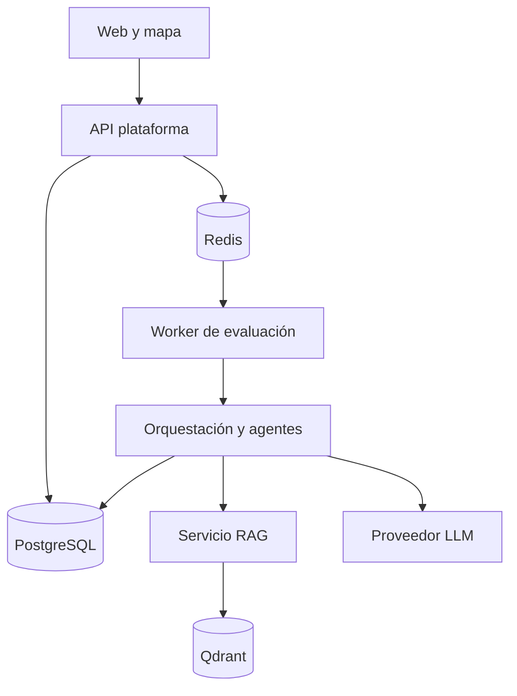
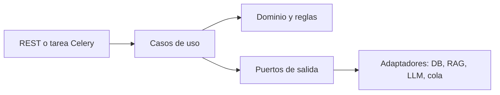

# Documento maestro — Sistema multiagente para la priorización de proyectos de inversión municipal

**Versión:** 1.0 · **Fecha:** 25/09/2026 · **Curso:** Taller de Proyectos · **Ámbito de prueba:** El Tambo, Huancayo

> Documento de contexto para integrantes del equipo y agentes de desarrollo. Constituye la base de producto y arquitectura. Cuando un detalle aparezca como «por definir», no debe inventarse ni implementarse silenciosamente.

## 1. Propósito y alcance

Desarrollar un **prototipo académico funcional** que registre expedientes simulados de inversión municipal, los preevalúe mediante agentes especializados, consulte documentos de referencia, permita revisión humana y produzca una cartera priorizada, explicable y auditable. Se implementan flujos y persistencia reales con datos de prueba. El resultado no autoriza obras, certifica viabilidad oficial, adjudica contratos ni transfiere fondos.

**Problema:** la evaluación manual de múltiples dimensiones y la asignación de recursos dificultan comparar propuestas. Las cifras de desperdicio, reducción de tiempo y multiplicación de errores mencionadas en el chárter son hipótesis o antecedentes pendientes de fuente comprobable; no son resultados del proyecto.

**Objetivo verificable:** demostrar que al menos dos proyectos de prueba atraviesan el flujo completo y que una persona puede reproducir la puntuación, identificar fuentes, revisar una alerta y explicar por qué uno quedó antes que otro.

**Dentro del alcance final:** gestión de proyectos y versiones, cinco preevaluaciones referenciales, coordinación, RAG documental, pausa y revisión, configuración de criterios, ranking presupuestario, escenarios, mapa básico, PDF y auditoría.

**Fuera del alcance:** conexión en vivo con Invierte.pe, PIDE, bancos o tesorería; firma digital jurídicamente válida sin certificados; determinación definitiva de cumplimiento jurídico o ingeniería; despliegue municipal con disponibilidad garantizada.

## 2. Glosario y decisiones fundamentales

| Término | Significado en este proyecto |
|---|---|
| Agente | Componente que evalúa una dimensión y devuelve un resultado estructurado con evidencia. Puede emplear reglas, cálculos y LLM; no es necesariamente un proceso o microservicio separado. |
| Servicio | Proceso desplegable con API o consumidor de cola y responsabilidad propia. |
| Arquitectura hexagonal | Organización **interna** de un servicio: dominio y casos de uso, puertos, adaptadores. Las dependencias del dominio apuntan hacia abstracciones propias. |
| Microservicios | Separación **entre** procesos con contratos, despliegue y propiedad de datos. Una colección de clases Agente no constituye microservicios. |
| RAG | Recuperación de fragmentos identificables para fundamentar respuestas. El LLM no realiza los cálculos deterministas ni decide la aprobación humana. |
| HITL | Pausa persistida, revisión por usuario autorizado y reanudación controlada. |
| PMV 1 | Primera entrega vertical obligatoria: un expediente, **agente económico real**, resultado persistido y explicación visible. |
| Firma | Para este prototipo: aprobación autenticada con bitácora y hash de integridad; no se anuncia como firma digital de validez legal. |

**Aclaración para el profesor:** se pueden presentar ambos estilos sin conflicto. El diagrama de microservicios explica procesos y conexiones. El diagrama hexagonal muestra la estructura interna de uno o varios de esos servicios. El diagrama de paquetes muestra módulos de código. El de despliegue muestra contenedores y nodos físicos o lógicos.

## 3. Actores y permisos

| Operación | Administrador | Planificador | Asesor jurídico | Gerente | Autoridad | Auditor |
|---|---:|---:|---:|---:|---:|---:|
| Configurar usuarios, pesos y fuentes | Sí | No | No | No | No | No |
| Crear/editar expedientes | No | Sí | No | No | No | No |
| Iniciar evaluación | No | Sí | No | No | No | No |
| Revisar alerta jurídica | No | No | Sí | Sí | No | No |
| Aprobar/observar pausa | No | No | Según asignación | Sí | No | No |
| Consultar cartera y mapa | Sí | Sí | Sí | Sí | Sí | Sí |
| Consultar auditoría completa | Sí | No | No | No | No | Sí |

Una persona puede tener más de un rol en las pruebas, pero la aplicación debe comprobar el permiso por acción. Las identidades y firmas del prototipo serán ficticias.

## 4. Requerimientos funcionales globales

Cada RF representa una **capacidad amplia**; las historias de usuario de la sección 6 descomponen comportamientos observables y condiciones de aceptación.

| RF | Capacidad global | Resultado esperado |
|---|---|---|
| RF01 | Gestionar identidad y acceso por roles. | Solo usuarios autorizados realizan acciones protegidas. |
| RF02 | Administrar criterios, pesos, umbrales y versiones de configuración. | Cada evaluación conserva la versión usada; pesos suman 100 %. |
| RF03 | Gestionar fuentes normativas y técnicas versionadas. | Se sabe qué documentos estaban activos en cada ejecución. |
| RF04 | Registrar y versionar proyectos y expedientes. | Datos y adjuntos tienen responsable, fecha y versión. |
| RF05 | Validar completitud y transiciones de expediente. | Se muestran errores concretos y estados permitidos. |
| RF06 | Orquestar evaluaciones y registrar fallos. | Se ejecutan agentes pertinentes y se consolida una salida estructurada. |
| RF07 | Preevaluar dimensión económica y socioeconómica. | Fórmulas, entradas, puntuación y justificación verificables. |
| RF08 | Preevaluar dimensión social y equidad. | Indicadores, fuente y explicación referencial. |
| RF09 | Preevaluar dimensión ambiental. | Alertas y puntuación referencial respaldadas. |
| RF10 | Preevaluar dimensión técnica y plazos. | Criterios técnicos y PERT cuando haya datos. |
| RF11 | Preevaluar dimensión jurídica y zonificación. | Alertas con documento, versión y fragmento; revisión ante duda. |
| RF12 | Recuperar y citar conocimiento documental. | Consulta indexada con referencias trazables y abstención sin evidencia. |
| RF13 | Gestionar interrupciones y revisión humana. | Pausa, motivo, decisión autenticada y reanudación o nueva evaluación. |
| RF14 | Consolidar puntuaciones y priorizar cartera. | Pesos, presupuesto, elegibilidad, ranking y razones reproducibles. |
| RF15 | Visualizar resultados y ubicación. | Panel y mapa con geometría disponible. |
| RF16 | Exportar informes. | PDF con evaluación, fuentes, revisión y escenario. |
| RF17 | Registrar y consultar auditoría. | Historial de acciones y versiones sin edición ordinaria. |
| RF18 | Ejecutar tareas largas de modo asíncrono. | Solicitud retorna identificador; el usuario consulta estado y fallos. |

## 5. Requerimientos no funcionales y reglas

| RNF | Criterio verificable en el prototipo |
|---|---|
| RNF01 Seguridad | API verifica token y permisos; se prueban accesos permitidos y prohibidos. Secretos fuera del repositorio. |
| RNF02 Persistencia | Reiniciar contenedores no elimina expedientes, resultados ni revisiones pendientes. |
| RNF03 Integridad | Decisiones tienen actor, instante, contenido canónico y hash verificable; una nueva versión no sobreescribe la anterior. |
| RNF04 Explicabilidad | Toda puntuación indica datos, fórmula, pesos y versión; toda afirmación documental indica fuente o incertidumbre. |
| RNF05 Rendimiento | El inicio de una evaluación larga devuelve un ID sin esperar el análisis; registrar tiempo observado, sin prometer un SLA municipal. |
| RNF06 Resiliencia | Si falla un agente, la ejecución pasa a error o parcial; no se publica ranking definitivo incompleto. Reintentos idempotentes. |
| RNF07 Reproducibilidad | Misma entrada/versiones/algoritmo producen igual puntuación numérica; texto LLM puede variar y no modifica el cálculo. |
| RNF08 Interoperabilidad | Endpoints documentados con OpenAPI; compatibilidad futura con PIDE no implica integración existente. |
| RNF09 Calidad RAG | Banco pequeño de preguntas con fuentes esperadas; informar precisión de citas y tasa de respuestas sin sustento, con muestra y método. |
| RNF10 Usabilidad | Formularios con validaciones claras, estados visibles, teclado y alertas no dependientes solo de color. |
| RNF11 Despliegue | Docker Compose, variables de ejemplo, migraciones, datos semilla y guía para reproducir el recorrido. |
| RNF12 Privacidad | Datos ficticios o públicos identificados; ningún expediente real sensible enviado a LLM externo. |

**Reglas de negocio:** un expediente incompleto no avanza; los pesos activos suman 100 %; una alerta crítica pendiente bloquea elegibilidad; solo el rol asignado resuelve pausas; modificar datos sustantivos invalida la aprobación previa; la suma de costos seleccionados no supera presupuesto; una afirmación jurídica sin fuente queda «requiere revisión»; un resultado automatizado nunca se presenta como decisión municipal oficial.

## 6. Historias de usuario específicas

Formato: *Como [rol], quiero [acción], para [beneficio].* Las condiciones listadas son comprobables, no promesas generales.

### Épica E1 — Acceso y configuración

**HU01 (RF01).** Como usuario, quiero iniciar sesión para acceder a mis funciones. **Aceptación:** credencial válida emite sesión; inválida devuelve error; sesión expirada no modifica datos.

**HU02 (RF01).** Como administrador, quiero asignar roles para limitar acciones. **Aceptación:** cambiar el rol modifica permisos efectivos; un planificador no resuelve HITL mediante la API.

**HU03 (RF02).** Como administrador, quiero registrar criterios y pesos para determinar el ranking. **Aceptación:** no se activa configuración que no sume 100 %; una evaluación anterior conserva los pesos originales.

**HU04 (RF03).** Como administrador, quiero cargar y desactivar documentos con versión y ámbito para controlar las fuentes. **Aceptación:** desactivar impide uso futuro sin borrar citas históricas.

### Épica E2 — Expedientes

**HU05 (RF04).** Como planificador, quiero crear un proyecto con código, ubicación, costo y beneficiarios para evaluarlo. **Aceptación:** campos obligatorios y formatos se validan; se guarda responsable y fecha.

**HU06 (RF04).** Como planificador, quiero adjuntar archivos para conservar el sustento. **Aceptación:** se vinculan a la versión exacta; se rechazan formatos o tamaños fuera del límite configurado.

**HU07 (RF05).** Como planificador, quiero ver qué datos faltan para completarlos. **Aceptación:** lista de campos específicos; el botón evaluar queda bloqueado si faltan datos obligatorios.

**HU08 (RF04–RF05).** Como planificador, quiero corregir mi expediente para volver a evaluarlo. **Aceptación:** se crea nueva versión y el informe previo permanece consultable.

### Épica E3 — Evaluación multiagente

**HU09 (RF06, RF18).** Como planificador, quiero iniciar una evaluación y consultar su avance. **Aceptación:** se obtiene ID, estado y resultados o error; repetir la misma petición con clave de idempotencia no duplica evaluación.

**HU10 (RF07).** Como planificador, quiero ver costo por beneficiario para comparar inversiones. **Aceptación:** se muestra `presupuesto / beneficiarios`, unidades y manejo de beneficiarios igual a cero.

**HU11 (RF07).** Como planificador, quiero consultar la puntuación económica para entenderla. **Aceptación:** se exponen entradas, método normalizado y limitaciones; no se inventa retorno sin datos.

**HU12 (RF08).** Como planificador, quiero ver acceso a salud, educación y transporte para conocer el impacto social. **Aceptación:** cada indicador identifica origen y si es simulado.

**HU13 (RF08).** Como planificador, quiero ver criterios de equidad para conocer quiénes se benefician. **Aceptación:** sin datos demográficos se marca insuficiencia, sin asignar una proporción inventada.

**HU14 (RF09).** Como planificador, quiero ver impactos ambientales y mitigaciones para revisar riesgos. **Aceptación:** resultado diferencia declaración del expediente, evidencia y recomendación.

**HU15 (RF10).** Como planificador, quiero ver la estimación PERT para comparar plazos. **Aceptación:** con `a`, `m`, `b` válidos se muestra `(a+4m+b)/6`; entradas inválidas generan error.

**HU16 (RF10).** Como planificador, quiero ver observaciones técnicas para corregir problemas antes del ranking. **Aceptación:** cada observación tiene criterio y gravedad; no equivale a aprobación profesional.

**HU17 (RF11–RF12).** Como asesor jurídico, quiero abrir el fragmento que sustenta una alerta para verificarla. **Aceptación:** se muestran documento, versión, página/sección disponible y extracto; sin fuente se exige revisión.

**HU18 (RF06).** Como planificador, quiero ver las cinco salidas reunidas para entender el expediente. **Aceptación:** estado por agente; un fallo no aparece como resultado aprobado.

### Épica E4 — Revisión humana

**HU19 (RF13).** Como gerente, quiero recibir un caso pausado con su motivo para revisarlo. **Aceptación:** una alerta configurada crea tarea asignada y persiste tras reinicio.

**HU20 (RF13).** Como asesor jurídico autorizado, quiero registrar una observación con fundamento para resolver dudas documentales. **Aceptación:** actor, fecha, motivo y versión quedan guardados.

**HU21 (RF13).** Como gerente, quiero aprobar, observar o rechazar la continuación para controlar el flujo. **Aceptación:** decisión requiere autenticación y motivo; un usuario no autorizado recibe denegación.

**HU22 (RF13).** Como planificador, quiero que la evaluación continúe tras la revisión para obtener un resultado. **Aceptación:** se reanuda el estado persistido; si cambian entradas esenciales, se genera nueva evaluación.

**HU23 (RF13, RF17).** Como auditor, quiero comprobar integridad de una aprobación para detectar alteraciones. **Aceptación:** el hash coincide con el contenido original; una modificación deliberada produce verificación fallida.

### Épica E5 — Priorización y escenarios

**HU24 (RF14).** Como planificador, quiero ver la contribución de cada criterio a la puntuación para explicar el ranking. **Aceptación:** puntuación total se recalcula con pesos y valores visibles.

**HU25 (RF14).** Como planificador, quiero introducir presupuesto y seleccionar candidatos para generar una cartera. **Aceptación:** costo acumulado no excede el límite; se explica cada exclusión.

**HU26 (RF14).** Como planificador, quiero comparar dos escenarios de pesos o presupuesto para ver cómo cambia el orden. **Aceptación:** ambos guardan configuración y resultados propios.

**HU27 (RF14).** Como gerente, quiero que un proyecto con alerta crítica pendiente no sea elegible para cartera final. **Aceptación:** se visualiza como pendiente, con causa; la resolución autorizada actualiza elegibilidad.

### Épica E6 — Consulta, reporte y auditoría

**HU28 (RF15).** Como autoridad, quiero consultar el ranking y detalle del proyecto para revisar recomendaciones. **Aceptación:** filtros por estado y acceso a los cálculos.

**HU29 (RF15).** Como autoridad, quiero ver proyectos georreferenciados para entender su distribución. **Aceptación:** clic abre resumen; proyectos sin coordenadas se enumeran fuera del mapa.

**HU30 (RF16).** Como autoridad, quiero descargar un PDF para compartir la evaluación académica. **Aceptación:** contiene versiones, puntuaciones, fuentes, estado HITL y marca de prototipo.

**HU31 (RF17).** Como auditor, quiero ver la secuencia de cambios para reconstruir una evaluación. **Aceptación:** historial ordenado muestra actor, fecha, acción, versión y referencia.

**HU32 (RF18).** Como planificador, quiero recibir una indicación cuando falla una evaluación para poder reintentarla. **Aceptación:** error legible, registro técnico y reintento sin duplicar resultados definitivos.

## 7. Modelo de datos y contratos mínimos

**Entidades:** `Usuario`, `Rol`, `Proyecto`, `VersionExpediente`, `Adjunto`, `FuenteDocumental`, `VersionCriterios`, `Evaluacion`, `ResultadoAgente`, `Alerta`, `RevisionHumana`, `Escenario`, `ProyectoEscenario`, `EventoAuditoria`. Identificadores UUID; fechas con zona horaria; dinero en DECIMAL y moneda PEN; coordenadas WGS84; documentos con versión y hash.

**Estados de proyecto:** borrador, incompleto, listo, evaluando, pendiente_revision, evaluado, priorizado, cerrado, error. Los cambios permitidos deben modelarse como transiciones verificadas, no edición libre de una columna.

**Contrato de resultado de agente:** `evaluation_id`, `agent_type`, `input_version`, `criteria_version`, `score_0_100` (o `null`), `metrics` con unidades, `evidence[]` con documento/versión/localizador, `warnings[]`, `status` (`completed|insufficient_data|failed`), `model_version`, `started_at`, `finished_at`. Las puntuaciones se calculan con funciones deterministas; el LLM puede redactar o extraer evidencia, que se valida.

**Contrato de evento/tarea:** `event_id`, `event_type`, `evaluation_id`, `project_version`, `occurred_at`, `correlation_id`, `schema_version`. Consumidores idempotentes por `event_id`.

**Endpoints orientativos:** `POST /projects`, `GET /projects/{id}`, `POST /projects/{id}/versions`, `POST /evaluations`, `GET /evaluations/{id}`, `GET /evaluations/{id}/results`, `POST /reviews/{id}/decisions`, `POST /scenarios`, `GET /scenarios/{id}`, `GET /reports/{id}.pdf`, `GET /audit?project_id=...`. Toda operación protegida requiere autorización en servidor; OpenAPI describe entradas y salidas. Los detalles definitivos se fijan antes de programar cada módulo.

## 8. Arquitectura de microservicios: propuesta viable

El dibujo original separa seis agentes, seis bases, un coordinador, gateway, outbox, RAG, telemetría y varios nodos. Es una **arquitectura objetivo**, demasiado costosa como requisito de PMV 1. Para este semestre se usarán **límites lógicos estables** y procesos desplegables incrementales. No se confundirá un módulo con un microservicio ni un contenedor con un servidor físico.

| Servicio desplegable | Propiedad y responsabilidad | PMV 1 | Entrega final |
|---|---|---|---|
| Web | Formularios, estados, resultado y posteriormente mapa. | Sí | Sí |
| API de plataforma | Autenticación, expedientes, criterios, escenarios, auditoría y adaptador de orquestación. | Sí | Sí |
| Worker de evaluación | Agente económico y, después, otros agentes; cálculos y contratos uniformes. | Sí, proceso separado | Sí |
| Orquestador | Flujo LangGraph, checkpoints y HITL. | Flujo simple en API/worker | Servicio separado si aporta a la integración |
| RAG | Ingesta, búsqueda y citas en Qdrant. | No bloquea PMV 1 | Sí para agente jurídico |
| Otros agentes | Social, ambiental, técnico, jurídico como módulos independientes con puertos. | No | Sí, separación en procesos solo si equipo y tiempo permiten |

**Decisión técnica:** para PMV 1, API y worker son dos procesos con contrato de tarea, PostgreSQL y Redis. El agente económico es módulo hexagonal del worker. Para la entrega final se puede extraer agentes en servicios separados sin cambiar los contratos, pero **no se prometen cinco bases físicas** por el mero hecho de mostrar cinco agentes. Si el docente exige microservicios distinguibles, API/worker/RAG constituyen servicios desplegables; separar el agente jurídico como cuarto proceso es una ampliación justificada.

**Propiedad de datos:** PostgreSQL de plataforma es fuente de verdad de expedientes, puntuaciones consolidadas, revisiones y auditoría. Los agentes no escriben directamente sus tablas de otro servicio: entregan un resultado por contrato. Qdrant indexa copias de documentos y no es fuente jurídica maestra. Se pueden separar esquemas o bases al extraer servicios; no dibujar «database-per-service» hasta que exista propiedad independiente efectiva.



El diagrama representa el despliegue **final simplificado**. En PMV 1, RAG, Qdrant y LLM pueden no levantarse: el agente económico calcula y explica mediante reglas. No se necesita LLM para demostrar que un agente ejecuta una tarea especializada y devuelve un resultado.

### Comunicación y consistencia

Web → API por HTTP/JSON; API → worker por tarea Celery/Redis; worker → API por persistencia controlada o endpoint interno de resultados (elegir una ruta, documentarla y evitar dobles escrituras). API ↔ orquestador por llamada interna cuando se separe. RAG expone búsqueda con evidencias. `evaluation_id` correlaciona logs y resultados.

Para PMV 1, un `POST /evaluations` crea el registro y publica tarea. Si falla la publicación, marca error recuperable; la tarea es idempotente. **Transactional outbox** se reserva para cuando existan eventos entre servicios y una pérdida de publicación sea un riesgo real; no se añaden seis outboxes antes de contar con seis dueños de datos. Celery/Redis no garantiza por sí mismo exactamente una ejecución: el consumidor debe tolerar reintentos.

## 9. Arquitectura hexagonal y de paquetes

La hexagonal se aplica **dentro** de API, worker y RAG. LangGraph, CrewAI, Celery, Qdrant y PostgreSQL pertenecen a adaptadores o composición de aplicación; las entidades del dominio no deben importarlos. En particular, `interrupt()` es mecanismo del adaptador de workflow, no método de la entidad `FlujoEvaluacion`. Los checkpoints son persistencia técnica; la auditoría de decisiones es un registro de negocio separado.



**Ejemplo, agente económico:** entrada `EvaluateEconomic(project_snapshot, criteria_version)`; dominio `EconomicAssessment`, validación de presupuesto y beneficiarios, costo por beneficiario y normalización; puertos `AssessmentRepository`, `CriteriaReader`, opcional `EvidenceSearch`; adaptadores consumidor Celery, PostgreSQL y cliente RAG. Nunca se usa el LLM para efectuar una división o fabricar un retorno socioeconómico.

**Estructura sugerida de repositorio:**

```text
project/
  apps/web/                    # páginas, formularios, mapa
  services/platform-api/
    src/domain/                # entidades y reglas
    src/application/           # casos de uso y puertos
    src/adapters/inbound/      # REST
    src/adapters/outbound/     # PostgreSQL, broker
  services/evaluation-worker/
    src/domain/economic/       # entidad, cálculos, validación
    src/domain/social/
    src/domain/environmental/
    src/domain/technical/
    src/domain/legal/
    src/application/           # casos de uso, contratos
    src/adapters/inbound/      # consumidor Celery
    src/adapters/outbound/     # repositorio, RAG, LLM
    src/workflows/             # LangGraph y HITL, cuando aplique
  services/rag/                # ingesta, búsqueda y referencias
  packages/contracts/         # esquemas versionados, sin lógica de negocio
  infra/compose.yaml
  docs/                        # decisiones, API, pruebas
  tests/fixtures/              # datos ficticios reproducibles
```

`packages/contracts` evita definiciones incompatibles, pero cada servicio valida mensajes recibidos. Evitar que el API importe código interno de un agente o que un agente lea tablas ajenas.

## 10. Despliegue

**PMV 1 local, una computadora:** contenedores `web`, `api`, `worker`, `postgres`, `redis`. Web expone puerto al navegador; API expone puerto de desarrollo; PostgreSQL y Redis quedan en red privada Compose. Volúmenes persistentes para PostgreSQL. Credenciales de desarrollo en `.env` no versionado y `.env.example` sin secretos. Migraciones y semillas crean dos cuentas y dos proyectos ficticios.

**Entrega final local:** añadir `rag` y `qdrant`; opcional `orchestrator` separado. El proveedor LLM será externo configurable o local si el equipo puede ejecutarlo. `compose.yaml` documenta perfiles para levantar PMV 1 y versión final. Nginx, HTTPS público, Prometheus/Grafana y LangSmith/Langfuse pueden mostrarse como extensión, pero no son necesarios para afirmar que el flujo académico funciona. Los «nodos» de los diagramas previos representan **grupos lógicos de contenedores**, no máquinas dedicadas adquiridas.

## 11. Flujos principales

**Evaluación:** planificador crea expediente → validación de datos → API registra ejecución → worker procesa agente(s) → resultado estructurado persiste → coordinador calcula puntuación → alerta crítica pausa → usuario autorizado decide → reanudación/nueva versión → escenario presupuestario → PDF e historial.

**RAG jurídico:** administrador carga fuente con metadatos → extracción y fragmentación con localizadores → indexación en Qdrant → agente consulta → recibe fragmentos y versión → redacta hallazgo verificable o se abstiene → asesor revisa alerta. BM25 híbrido y fragmentación padre/hijo son decisiones técnicas del chárter para la fase final; la evaluación RAG determina si mejoran recuperación frente a una búsqueda simple.

**Priorización mínima reproducible:** cada dimensión válida entrega 0–100. La puntuación ponderada es `Σ(peso_i × puntuación_i)/100`; pesos y escala son configurables. El ranking ordena descendente; para empates usar menor costo y luego código. El escenario incorpora proyectos elegibles en ese orden mientras alcance presupuesto; marca por qué excluye cada uno. Este algoritmo es una **heurística explícita**, no resuelve automáticamente RCMPSP ni prueba optimalidad global. Un optimizador puede añadirse y compararse con esta línea base.

## 12. PMV 1 — obligatorio

**Meta:** demostrar un agente especializado funcionando dentro de un flujo real, con persistencia y explicación. Elegimos el **agente económico** porque sus fórmulas son verificables y no depende inicialmente de un corpus normativo ni de LLM.

**Incluye:** login de dos roles (administrador y planificador), alta de proyecto con presupuesto y beneficiarios, validación, criterios económicos versionados, `POST /evaluations`, tarea Celery en Redis, cálculo por el agente económico, resultado 0–100 conforme a una regla documentada, justificación con entradas/fórmula, estado visible, PostgreSQL y una entrada de auditoría. Dos proyectos semilla permiten una comparación simple. Docker Compose y README levantan el conjunto.

**Definición de terminado:**

1. Un planificador ingresa proyecto A con presupuesto S/ 120 000 y 600 beneficiarios; el agente muestra costo S/ 200 por beneficiario.
2. Un proyecto B con S/ 90 000 y 300 beneficiarios muestra S/ 300 por beneficiario.
3. Se ve el estado `pendiente → procesando → completado`, ID, entradas y fórmula.
4. Beneficiarios 0 o presupuesto negativo producen validación y ninguna puntuación definitiva.
5. Un planificador no cambia criterios; un administrador sí, sin alterar resultados anteriores.
6. Reiniciar API/worker conserva proyectos y resultados. Reintentar la misma tarea no duplica el resultado.
7. README permite reproducirlo en otra computadora. Tests unitarios verifican cálculos y un test de integración cubre API → cola → worker → DB.

**Corte PMV 1:** no requiere GIS, PDF, RAG, cinco agentes, aprobación jurídica ni múltiples bases de datos. Ese corte no redefine el alcance final; fija un primer incremento demostrable.

## 13. Evolución después del PMV 1

| Entrega | Resultado integrado | Dependencia |
|---|---|---|
| Incremento 2 | Agentes social, ambiental y técnico con reglas, fuentes y resultado uniforme; consolidación con pesos. | Contrato del agente económico estable. |
| Incremento 3 | Ingesta RAG, agente jurídico con citas y abstención; evaluación de recuperación. | Documentos de prueba versionados. |
| Incremento 4 | LangGraph y checkpoints, alertas HITL, revisión autenticada y reanudación. | Estados/versiones y roles. |
| Incremento 5 | Escenarios, ranking con presupuesto, mapa, PDF y auditoría completa. | Cinco resultados y reglas de elegibilidad. |

Un incremento se considera completado tras recorrer interfaz → API → procesamiento → persistencia → presentación, incluyendo un caso de error. Se prioriza integración vertical antes que crear repositorios vacíos para todos los agentes.

## 14. Datos de prueba y evaluación

Preparar al menos: proyecto completo sin alerta; proyecto incompleto; proyecto con posible conflicto de zonificación; dos proyectos que compiten por presupuesto; caso con plazo PERT; revisión humana aprobada y observada; documento desactivado tras evaluación. Registrar para cada dato si procede de fuente pública o es inventado. Las fuentes normativas requieren verificación de vigencia antes de cargar y localizadores para citas.

**Pruebas esenciales:** permisos cruzados; validación de cero/división; cálculo y pesos; límite presupuestario; cambio de versión; repetición de tarea; fallo de agente; persistencia tras reinicio; cita inexistente y abstención; pausa/reanudación y revocación de aprobación tras cambio de expediente; integridad de auditoría; PDF consistente con pantalla. Métricas de RAG y tiempos se reportan con cantidad de casos y entorno, sin umbrales arbitrarios.

## 15. Riesgos y decisiones pendientes

| Riesgo/decisión | Acción concreta |
|---|---|
| Falta de datos territoriales reales | Usar casos simulados identificados y explicitar límites de cada indicador. |
| Ambición de cinco microservicios y bases | PMV 1 con API + worker; extraer solo por responsabilidad y capacidad real de operación. |
| LangGraph + CrewAI duplican coordinación | LangGraph gobierna transiciones y pausas; CrewAI, si se utiliza, ejecuta roles de agente dentro de nodos. Un único dueño de estado. |
| LLM alucina norma o cálculo | Cálculos deterministas, citas comprobables, abstención y revisión humana. |
| Norma o plan desactualizado | Registrar versión, fuente y fecha; validar aplicabilidad antes de la demostración. |
| Método económico sin datos de beneficios | Usar costo por beneficiario y otro indicador definido; no inventar retorno monetario. |

**Por definir con el equipo:** lenguaje/framework web definitivo (React o Next.js); ponderaciones iniciales y normalización de cada dimensión; documentos públicos exactos y permisos de uso; campos mínimos por tipo de obra; fuente y formato GIS; límites de archivos; proveedor LLM y presupuesto; reparto de responsables. Las alternativas en los diagramas anteriores no constituyen decisiones cerradas.

## 16. Instrucciones para un agente de desarrollo que reciba este archivo

1. Tratar este documento como contexto del producto, no como prueba de que el código existe.
2. Inspeccionar el repositorio real y reportar qué RF/HU están implementados, pendientes o contradichos.
3. Preguntar solo por decisiones marcadas «por definir» que bloqueen la tarea concreta; proponer un supuesto reversible para las demás.
4. Respetar la separación RF global → HU específica → caso de aceptación, y arquitectura entre servicios → hexagonal interna → paquetes → despliegue.
5. Comenzar por PMV 1 y completar su recorrido; no generar cinco servicios vacíos ni afirmar firma legal, cumplimiento normativo oficial u optimización global.
6. Para cada cambio, vincular RF, HU, prueba y evidencia observable. Mantener datos y credenciales de prueba fuera de producción.

## 17. Fuentes de contexto del equipo

- Chárter proporcionado por el equipo: alcance, agentes, LangGraph, CrewAI, Qdrant, Celery, PostgreSQL e hitos del semestre.
- Diagramas preliminares de paquetes, microservicios, despliegue y hexágonos proporcionados por el equipo. Este documento corrige su mezcla de niveles de abstracción y propone una implementación incremental.
- Requisitos y HU redactados en la conversación de trabajo del 25/09/2026, reorganizados aquí con RF globales e historias verificables.

**Control de cambios:** v1.0 consolida el alcance académico y define PMV 1. Cualquier decisión posterior sobre stack, puntuación o fuentes debe actualizar esta versión y reflejarse en contratos, diagramas y pruebas.
