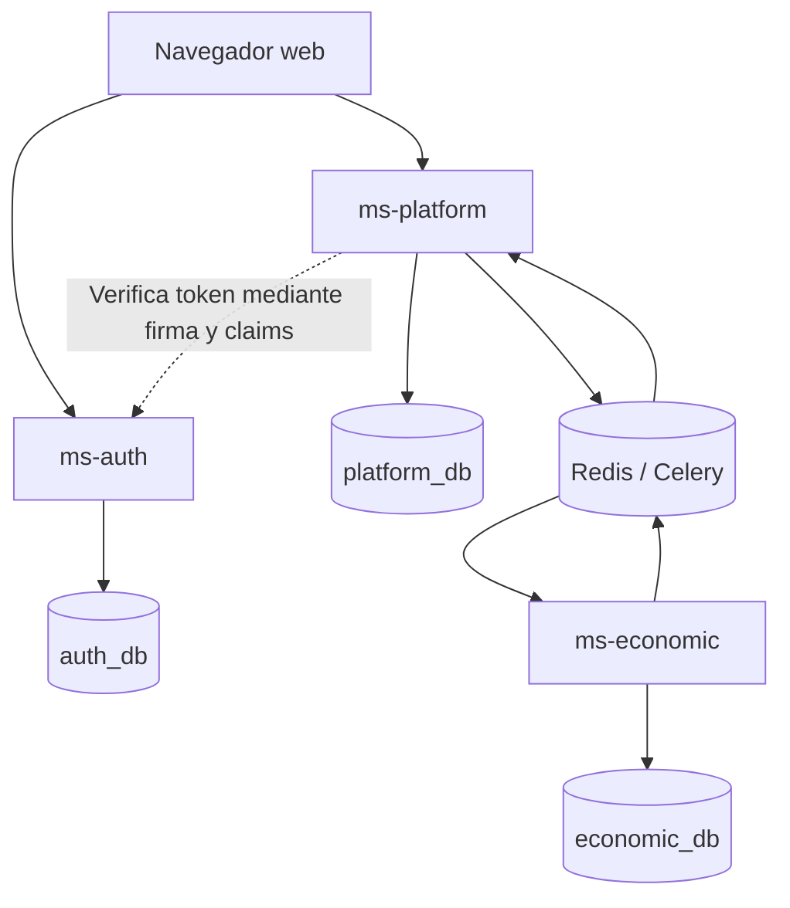
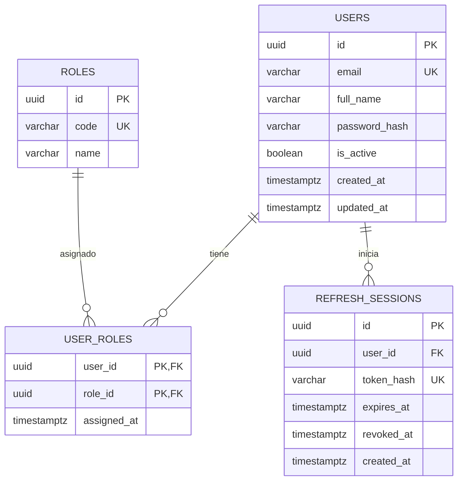
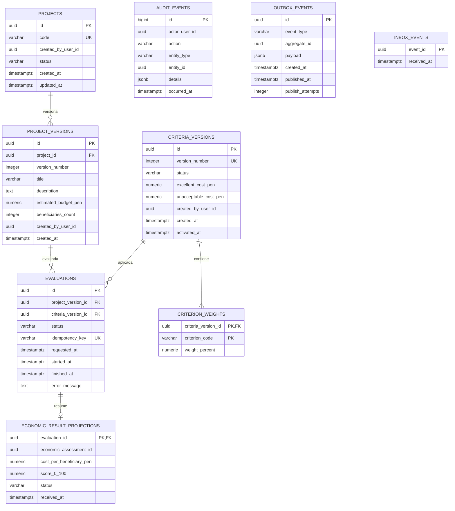
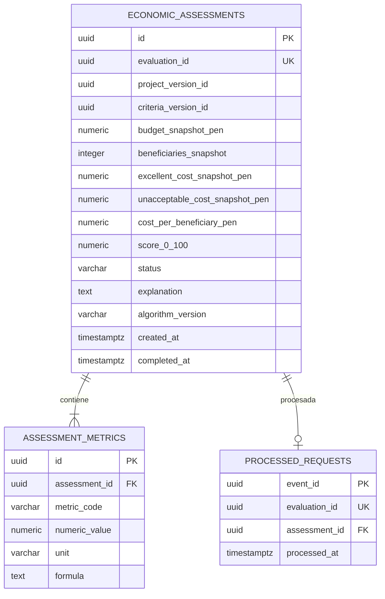
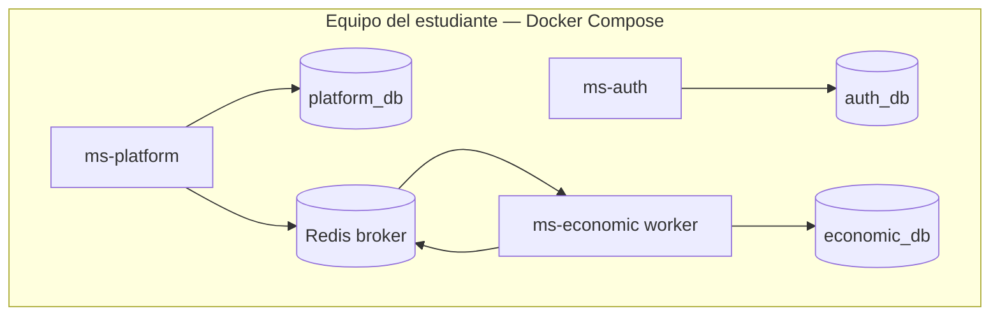

# Modelo de bases separadas — arquitectura objetivo e integración experimental

**Proyecto:** Sistema multiagente para la priorización de proyectos de inversión municipal  
**Versión:** 1.1 · **Fecha:** 02/10/2026 · **Motor:** PostgreSQL 16+ · **Ámbito:** datos de prueba
**Referencia visual:** diagrama de bases separadas por microservicio aportado por el equipo (sistema clínico). Esta propuesta modela el proyecto municipal, no reutiliza sus entidades clínicas.

> **Decisión de alcance vigente:** el PMV 1 del curso se demuestra íntegramente en el frontend con persistencia local y un agente económico simulado que ejecuta cálculos reales. Este documento conserva el diseño de bases separadas y describe la integración backend ya presente en el repositorio, pero levantarla no es requisito para terminar ni presentar la simulación.

## 1. Arquitectura objetivo

Para una integración posterior con **un agente económico desplegado como proceso**, se proponen tres responsabilidades y tres bases lógicas. Las tres bases pueden alojarse en **un solo contenedor PostgreSQL** con propietarios distintos. Esto evita confundir separación de datos con compra de tres servidores.

| Servicio objetivo | Responsabilidad de integración | Base exclusiva | Tablas |
|---|---|---|---|
| `ms-auth` | Login, roles, tokens y cuentas de prueba. | `auth_db` | `users`, `roles`, `user_roles`, `refresh_sessions` |
| `ms-platform` | Proyectos y versiones, criterios, evaluaciones, estados, proyección del resultado, auditoría, publicación fiable. Orquesta **un** agente. | `platform_db` | `projects`, `project_versions`, `criteria_versions`, `criterion_weights`, `evaluations`, `economic_result_projections`, `audit_events`, `outbox_events`, `inbox_events` |
| `ms-economic` | Procesar una solicitud económica, validar entradas, calcular costo por beneficiario y puntuación explicable. | `economic_db` | `economic_assessments`, `assessment_metrics`, `processed_requests` |

**PMV 1 frontend:** `web` usa un repositorio de simulación con esquema versionado en `localStorage`. Redis no participa y no se simula como fuente de verdad. **Integración experimental existente:** el repositorio también contiene FastAPI, tres bases lógicas, Redis/Celery, un worker económico y un worker de plataforma. `ms-auth` no está desplegado como proceso independiente: la API actual contiene autenticación y plataforma. LangGraph/HITL, RAG/Qdrant y los otros agentes no forman parte del PMV 1.

**Regla de propiedad:** solo `ms-auth` escribe `auth_db`; solo `ms-platform` escribe `platform_db`; solo `ms-economic` escribe `economic_db`. Los servicios no realizan `JOIN` ni `FOREIGN KEY` entre bases y no comparten credenciales de escritura. Los identificadores ajenos viajan en contratos de API/eventos y se guardan como UUID con nombre explícito.

## 2. Diagrama de contexto y propiedad

Mermaid representa bien la topología y cada ER por separado. Un único ER enorme con líneas entre bases sugeriría claves foráneas inexistentes. Este archivo se puede editar en Markdown; si el profesor exige un lienzo importable con tablas dentro de contenedores, se puede trasladar a draw.io conservando exactamente las entidades de los diagramas siguientes.



Las flechas de retorno representan mensajes o resultados, **nunca consultas directas a la base ajena**. En desarrollo, el API de plataforma valida JWT con clave pública o secreto compartido restringido y además verifica el rol requerido. `ms-auth` emite el token y administra identidades; `ms-platform` guarda solo `created_by_user_id` como referencia externa sin copiar contraseñas.

## 3. Diagrama ER — `ms-auth` / `auth_db`



**Simulación PMV 1:** `ADMIN` edita y activa umbrales económicos; `PLANNER` crea y versiona proyectos e inicia evaluaciones. Son permisos de interfaz, no autorización real de servidor. La administración de usuarios, pesos multidimensionales y el rol `AUDITOR` pertenecen a la arquitectura objetivo.

## 4. Diagrama ER — `ms-platform` / `platform_db`



`created_by_user_id` y `actor_user_id` son UUID emitidos por `ms-auth`: **sin FK física entre bases**. `economic_assessment_id` identifica un registro cuyo dueño es `ms-economic`; tampoco lleva FK. La proyección es una copia **mínima** para mostrar estados y ordenar resultados; el informe detallado se obtiene del contrato del agente o de una proyección ampliada posterior. No se escribe en ella manualmente desde la UI.

## 5. Diagrama ER — `ms-economic` / `economic_db`



Los UUID de `evaluation_id`, `project_version_id` y `criteria_version_id` provienen de `ms-platform` y se almacenan **sin FK local**. Los valores de entrada y umbrales se conservan como *snapshot*; una nueva política no cambia evaluaciones pasadas. Una evaluación corresponde a **un** análisis económico. Las métricas permiten agregar más indicadores sin alterar la tabla central.

## 6. Contratos y flujo transaccional

1. Usuario ingresa en `ms-auth`; token incluye `sub=user_id`, roles, emisor, audiencia y expiración. `ms-platform` verifica la firma y permisos.
2. Planificador guarda proyecto y versión en `platform_db`. La versión es inmutable después de enviarse a evaluación; corregir crea `version_number + 1`.
3. `POST /evaluations` valida presupuesto `> 0`, beneficiarios `> 0` y configuración activa. En **una transacción local** inserta `evaluations(status=queued)` y `outbox_events(event_type=EconomicEvaluationRequested)` con ID de evento estable.
4. Publicador de `ms-platform` lee outbox no publicado y envía a Redis/Celery; marca `published_at` tras confirmar publicación. Puede publicar dos veces si cae entre ambos pasos: el consumidor debe tolerarlo.
5. `ms-economic` recibe mensaje, verifica `event_id` en `processed_requests` y `evaluation_id` único, calcula y en **su propia transacción** escribe `economic_assessments`, `assessment_metrics`, `processed_requests`. Si es repetido, devuelve el resultado existente.
6. `ms-economic` publica `EconomicEvaluationCompleted` con `event_id`, `evaluation_id`, `economic_assessment_id`, costo por beneficiario, puntuación, explicación y versión de algoritmo. En la integración experimental actual el evento puede enviarse tras confirmar su transacción con reintento idempotente; para garantía ante caída exacta de publicación, añadir **outbox propia** al agente antes de afirmar entrega garantizada.
7. `ms-platform` usa `inbox_events(event_id)` e inserta o actualiza `economic_result_projections`, `evaluations(status=completed)` y `audit_events` en una transacción. Un evento duplicado no repite el cambio.

**Contrato de solicitud (JSON de ejemplo):**

```json
{
  "schema_version": 1,
  "event_id": "94f5280d-1ab1-4cef-8a28-20fe910a702e",
  "event_type": "EconomicEvaluationRequested",
  "evaluation_id": "e94f83e5-1040-4bfd-b07a-edaf70014777",
  "project_version_id": "f013cbcd-b2cf-4d9f-b444-9843e383795d",
  "criteria_version_id": "c09d67ca-9611-4788-8a98-32aa20be5a80",
  "budget_pen": "120000.00",
  "beneficiaries_count": 600,
  "excellent_cost_pen": "200.00",
  "unacceptable_cost_pen": "500.00"
}
```

El worker recibe una **instantánea validada** y no abre `platform_db`. Importes viajan como cadenas decimales para evitar redondeo binario. No incluir nombres o documentos personales en el mensaje.

## 7. Regla de puntuación específica del PMV 1

El costo por beneficiario es `presupuesto / beneficiarios`, en PEN/persona, redondeado a 2 decimales para presentación; el cálculo intermedio conserva precisión decimal.

Como **criterio didáctico configurable** del PMV 1: costo `<= excellent_cost` → 100 puntos; costo `>= unacceptable_cost` → 0 puntos; en medio → `100 × (unacceptable_cost − costo) / (unacceptable_cost − excellent_cost)`. Se limita el resultado a 0–100 y se redondea a 2 decimales. Debe cumplirse `0 < excellent_cost < unacceptable_cost`. Esta puntuación **no afirma retorno social real ni viabilidad económica**.

Ejemplos con excelente S/ 200 e inaceptable S/ 500 por persona:

| Proyecto | Presupuesto | Beneficiarios | Costo/persona | Puntos |
|---|---:|---:|---:|---:|
| A | S/ 120 000 | 600 | S/ 200 | 100 |
| B | S/ 90 000 | 300 | S/ 300 | 66,67 |

El peso `ECONOMIC` es 100 % en PMV 1. Cuando se incorporen agentes adicionales se activa **nueva versión** con cinco pesos que sumen 100 %; no se recalculan registros antiguos.

## 8. SQL de referencia — tres migraciones independientes

Aplicar cada bloque **solo en la base indicada** mediante el usuario dueño de ese servicio. UUID se generan en la aplicación; no requiere extensión. Los secretos y contraseñas se crean por una semilla segura, no aparecen en esta migración.

### 8.1 `auth_db` — `ms-auth`

```sql
CREATE TABLE users (
    id UUID PRIMARY KEY,
    email VARCHAR(254) NOT NULL UNIQUE,
    full_name VARCHAR(160) NOT NULL,
    password_hash VARCHAR(255) NOT NULL,
    is_active BOOLEAN NOT NULL DEFAULT TRUE,
    created_at TIMESTAMPTZ NOT NULL DEFAULT now(),
    updated_at TIMESTAMPTZ NOT NULL DEFAULT now(),
    CONSTRAINT users_email_lowercase CHECK (email = lower(email))
);

CREATE TABLE roles (
    id UUID PRIMARY KEY,
    code VARCHAR(40) NOT NULL UNIQUE,
    name VARCHAR(100) NOT NULL
);

CREATE TABLE user_roles (
    user_id UUID NOT NULL REFERENCES users(id) ON DELETE CASCADE,
    role_id UUID NOT NULL REFERENCES roles(id) ON DELETE RESTRICT,
    assigned_at TIMESTAMPTZ NOT NULL DEFAULT now(),
    PRIMARY KEY (user_id, role_id)
);

CREATE TABLE refresh_sessions (
    id UUID PRIMARY KEY,
    user_id UUID NOT NULL REFERENCES users(id) ON DELETE CASCADE,
    token_hash VARCHAR(255) NOT NULL UNIQUE,
    expires_at TIMESTAMPTZ NOT NULL,
    revoked_at TIMESTAMPTZ,
    created_at TIMESTAMPTZ NOT NULL DEFAULT now(),
    CONSTRAINT refresh_expiry CHECK (expires_at > created_at)
);

CREATE INDEX refresh_sessions_user_idx ON refresh_sessions(user_id, expires_at);
```

Guardar un hash de contraseña de algoritmo resistente (p. ej. Argon2id) y **hash del refresh token**; nunca contraseña/token en texto plano. Los JWT de acceso de vida corta no requieren tabla propia.

### 8.2 `platform_db` — `ms-platform`

```sql
CREATE TABLE projects (
    id UUID PRIMARY KEY,
    code VARCHAR(40) NOT NULL UNIQUE,
    created_by_user_id UUID NOT NULL,
    status VARCHAR(24) NOT NULL DEFAULT 'draft',
    created_at TIMESTAMPTZ NOT NULL DEFAULT now(),
    updated_at TIMESTAMPTZ NOT NULL DEFAULT now(),
    CONSTRAINT projects_status_check CHECK (status IN ('draft','ready','evaluating','evaluated','error'))
);

CREATE TABLE project_versions (
    id UUID PRIMARY KEY,
    project_id UUID NOT NULL REFERENCES projects(id) ON DELETE RESTRICT,
    version_number INTEGER NOT NULL CHECK (version_number > 0),
    title VARCHAR(200) NOT NULL,
    description TEXT NOT NULL DEFAULT '',
    estimated_budget_pen NUMERIC(18,2) NOT NULL CHECK (estimated_budget_pen > 0),
    beneficiaries_count INTEGER NOT NULL CHECK (beneficiaries_count > 0),
    created_by_user_id UUID NOT NULL,
    created_at TIMESTAMPTZ NOT NULL DEFAULT now(),
    UNIQUE (project_id, version_number)
);

CREATE TABLE criteria_versions (
    id UUID PRIMARY KEY,
    version_number INTEGER NOT NULL UNIQUE CHECK (version_number > 0),
    status VARCHAR(16) NOT NULL DEFAULT 'draft'
        CHECK (status IN ('draft','active','retired')),
    excellent_cost_pen NUMERIC(18,2) NOT NULL CHECK (excellent_cost_pen > 0),
    unacceptable_cost_pen NUMERIC(18,2) NOT NULL,
    created_by_user_id UUID NOT NULL,
    created_at TIMESTAMPTZ NOT NULL DEFAULT now(),
    activated_at TIMESTAMPTZ,
    CONSTRAINT costs_order_check CHECK (unacceptable_cost_pen > excellent_cost_pen)
);
CREATE UNIQUE INDEX only_one_active_criteria ON criteria_versions(status)
    WHERE status = 'active';

CREATE TABLE criterion_weights (
    criteria_version_id UUID NOT NULL REFERENCES criteria_versions(id) ON DELETE RESTRICT,
    criterion_code VARCHAR(40) NOT NULL,
    weight_percent NUMERIC(5,2) NOT NULL CHECK (weight_percent >= 0 AND weight_percent <= 100),
    PRIMARY KEY (criteria_version_id, criterion_code)
);

CREATE TABLE evaluations (
    id UUID PRIMARY KEY,
    project_version_id UUID NOT NULL REFERENCES project_versions(id) ON DELETE RESTRICT,
    criteria_version_id UUID NOT NULL REFERENCES criteria_versions(id) ON DELETE RESTRICT,
    requested_by_user_id UUID NOT NULL,
    status VARCHAR(24) NOT NULL DEFAULT 'queued'
        CHECK (status IN ('queued','processing','completed','failed')),
    idempotency_key VARCHAR(120) NOT NULL UNIQUE,
    requested_at TIMESTAMPTZ NOT NULL DEFAULT now(),
    started_at TIMESTAMPTZ,
    finished_at TIMESTAMPTZ,
    error_message TEXT
);

CREATE TABLE economic_result_projections (
    evaluation_id UUID PRIMARY KEY REFERENCES evaluations(id) ON DELETE RESTRICT,
    economic_assessment_id UUID NOT NULL UNIQUE,
    cost_per_beneficiary_pen NUMERIC(18,2) NOT NULL CHECK (cost_per_beneficiary_pen >= 0),
    score_0_100 NUMERIC(5,2) NOT NULL CHECK (score_0_100 BETWEEN 0 AND 100),
    status VARCHAR(16) NOT NULL DEFAULT 'completed' CHECK (status = 'completed'),
    explanation TEXT NOT NULL,
    algorithm_version VARCHAR(40) NOT NULL,
    received_at TIMESTAMPTZ NOT NULL DEFAULT now()
);

CREATE TABLE audit_events (
    id BIGINT GENERATED ALWAYS AS IDENTITY PRIMARY KEY,
    actor_user_id UUID,
    action VARCHAR(80) NOT NULL,
    entity_type VARCHAR(50) NOT NULL,
    entity_id UUID NOT NULL,
    details JSONB NOT NULL DEFAULT '{}'::jsonb,
    occurred_at TIMESTAMPTZ NOT NULL DEFAULT now()
);

CREATE TABLE outbox_events (
    id UUID PRIMARY KEY,
    event_type VARCHAR(80) NOT NULL,
    aggregate_id UUID NOT NULL,
    payload JSONB NOT NULL,
    created_at TIMESTAMPTZ NOT NULL DEFAULT now(),
    published_at TIMESTAMPTZ,
    publish_attempts INTEGER NOT NULL DEFAULT 0 CHECK (publish_attempts >= 0)
);

CREATE TABLE inbox_events (
    event_id UUID PRIMARY KEY,
    received_at TIMESTAMPTZ NOT NULL DEFAULT now()
);

CREATE INDEX versions_project_idx ON project_versions(project_id, version_number DESC);
CREATE INDEX evaluations_status_idx ON evaluations(status, requested_at);
CREATE INDEX evaluations_version_idx ON evaluations(project_version_id, requested_at DESC);
CREATE INDEX audit_entity_idx ON audit_events(entity_type, entity_id, occurred_at);
CREATE INDEX outbox_pending_idx ON outbox_events(created_at)
    WHERE published_at IS NULL;
```

**Restricción que requiere lógica transaccional:** al activar `criteria_versions`, validar que `SUM(criterion_weights.weight_percent)=100` y que para PMV 1 exista `ECONOMIC=100`. Un `CHECK` de PostgreSQL no puede agregar filas de otra tabla; activación mediante caso de uso con bloqueo transaccional. La aplicación impide editar una versión activa o ya utilizada; una modificación crea nueva versión. Igual para `project_versions` evaluadas. `audit_events` usa permisos de solo inserción para el usuario de aplicación; la cuenta de migración conserva permisos de administración. **No afirmar inmutabilidad criptográfica solo por permisos SQL.**

### 8.3 `economic_db` — `ms-economic`

```sql
CREATE TABLE economic_assessments (
    id UUID PRIMARY KEY,
    evaluation_id UUID NOT NULL UNIQUE,
    project_version_id UUID NOT NULL,
    criteria_version_id UUID NOT NULL,
    budget_snapshot_pen NUMERIC(18,2) NOT NULL CHECK (budget_snapshot_pen > 0),
    beneficiaries_snapshot INTEGER NOT NULL CHECK (beneficiaries_snapshot > 0),
    excellent_cost_snapshot_pen NUMERIC(18,2) NOT NULL CHECK (excellent_cost_snapshot_pen > 0),
    unacceptable_cost_snapshot_pen NUMERIC(18,2) NOT NULL,
    cost_per_beneficiary_pen NUMERIC(18,2) NOT NULL CHECK (cost_per_beneficiary_pen >= 0),
    score_0_100 NUMERIC(5,2) NOT NULL CHECK (score_0_100 BETWEEN 0 AND 100),
    status VARCHAR(16) NOT NULL DEFAULT 'completed' CHECK (status = 'completed'),
    explanation TEXT NOT NULL,
    algorithm_version VARCHAR(40) NOT NULL,
    created_at TIMESTAMPTZ NOT NULL DEFAULT now(),
    completed_at TIMESTAMPTZ NOT NULL DEFAULT now(),
    CONSTRAINT economic_thresholds_order
        CHECK (unacceptable_cost_snapshot_pen > excellent_cost_snapshot_pen)
);

CREATE TABLE assessment_metrics (
    id UUID PRIMARY KEY,
    assessment_id UUID NOT NULL REFERENCES economic_assessments(id) ON DELETE RESTRICT,
    metric_code VARCHAR(50) NOT NULL,
    numeric_value NUMERIC(18,4) NOT NULL,
    unit VARCHAR(40) NOT NULL,
    formula TEXT NOT NULL,
    UNIQUE (assessment_id, metric_code)
);

CREATE TABLE processed_requests (
    event_id UUID PRIMARY KEY,
    evaluation_id UUID NOT NULL UNIQUE,
    assessment_id UUID NOT NULL UNIQUE REFERENCES economic_assessments(id) ON DELETE RESTRICT,
    processed_at TIMESTAMPTZ NOT NULL DEFAULT now()
);

CREATE INDEX economic_project_version_idx ON economic_assessments(project_version_id, created_at DESC);
```

El estado `failed` se registra en `ms-platform` tras un evento de error y su causa. No se inserta una evaluación económica ficticia con puntuación cero cuando falla el cálculo: **cero es una puntuación válida**, no un indicador de error.

## 9. Matriz de relaciones entre servicios

| Origen | Campo | Destino lógico | Cómo se valida | FK física |
|---|---|---|---|---|
| `platform.projects` | `created_by_user_id` | `auth.users.id` | JWT firmado y rol en el momento de la acción | No |
| `platform.criteria_versions` | `created_by_user_id` | `auth.users.id` | JWT con `ADMIN` | No |
| `platform.evaluations` | `requested_by_user_id` | `auth.users.id` | JWT con `PLANNER` | No |
| `economic.economic_assessments` | `evaluation_id` | `platform.evaluations.id` | Mensaje emitido por plataforma; UUID y clave de idempotencia | No |
| `economic.economic_assessments` | `project_version_id` | `platform.project_versions.id` | Instantánea del evento validado | No |
| `platform.economic_result_projections` | `economic_assessment_id` | `economic.economic_assessments.id` | Evento de resultado y correlación `evaluation_id` | No |

No usar `dblink`, FDW ni credenciales de otra base para crear relaciones aparentes. El diagrama de referencia clínica usa conexiones visuales entre dominios; aquí esas conexiones se representan **con líneas punteadas de integración**, no con claves foráneas.

## 10. Despliegue local de bases

Una instancia PostgreSQL con `auth_db`, `platform_db`, `economic_db`; usuarios `auth_app`, `platform_app`, `economic_app` con permisos sobre **solo su base**; usuario de migración separado por base. Volúmenes persistentes y backups de desarrollo. Redis no contiene el registro definitivo de una evaluación. Cada microservicio recibe únicamente su `DATABASE_URL` y el broker según corresponda.



`DB1`, `DB2` y `DB3` son **bases lógicas dentro de un mismo PostgreSQL** en la integración experimental. No son tres servidores ni se requieren para la simulación PMV 1. Para impedir lectura cruzada, crear propietarios y permisos reales: el aislamiento no se cumple si todos reciben la contraseña `postgres`.

## 11. Pruebas de aceptación de la integración objetivo

1. Login `ADMIN` permite configurar criterios; `PLANNER` obtiene 403 al intentarlo.
2. Se crean proyecto A y B, cada uno con versión 1. A: S/ 120 000 y 600 personas; B: S/ 90 000 y 300 personas.
3. Política activa v1: `ECONOMIC=100`, excelente 200, inaceptable 500. Una segunda política no se activa si los pesos no suman 100.
4. Dos evaluaciones distintas resultan en costo/persona 200 y 300; puntuaciones 100 y 66,67 respectivamente.
5. `platform_db.economic_result_projections` referencia resultados reales de `economic_db`; la UI muestra fórmula, explicación e ID de evaluación.
6. Reenviar evento de solicitud con igual `event_id` o `evaluation_id` mantiene **un** `economic_assessment` y **una** proyección.
7. Corregir presupuesto crea versión 2; evaluación anterior conserva entrada y criterio versión 1.
8. Presupuesto negativo, beneficiarios 0 y umbrales invertidos son rechazados; no aparece puntuación final falsa.
9. Reiniciar los tres servicios y Redis conserva proyectos, evaluaciones y resultados; publicar un evento pendiente de outbox completa el flujo.
10. Credenciales de `ms-economic` no permiten leer `platform_db` ni `auth_db`; el worker funciona solo con el mensaje y su base.

## 12. Relación con el PMV 1 y próximos incrementos

La simulación PMV 1 cubre RF01 parcialmente mediante perfiles de interfaz; RF02 con criterios versionados; RF04–RF05 con proyectos y versiones; RF06–RF07/RF18 con estados y cálculo económico simulado; y RF17 parcialmente con historial local. Sus datos viven en el navegador y cada evaluación conserva snapshots.

El backend existente implementa una parte importante de esta arquitectura objetivo: `auth_db`, `platform_db`, `economic_db`, outbox/inbox, tareas Celery y proyección del resultado. Se conserva como integración experimental. No debe afirmarse que sus tres responsabilidades ya sean tres microservicios independientes ni que las pruebas frontend dependan de esa infraestructura.

En PMV 2, los agentes social, ambiental, técnico y jurídico pueden adoptar contratos equivalentes. **Crear una base por agente solo cuando ese agente sea servicio autónomo**; mientras sea módulo dentro de un worker compartido, mantener propiedad del worker. En HITL se añadirán revisiones y checkpoints a la base del dueño de la orquestación; Qdrant será índice de búsqueda, no base transaccional maestra. Antes de añadirlos, actualizar diagramas, migraciones y contratos de eventos.
